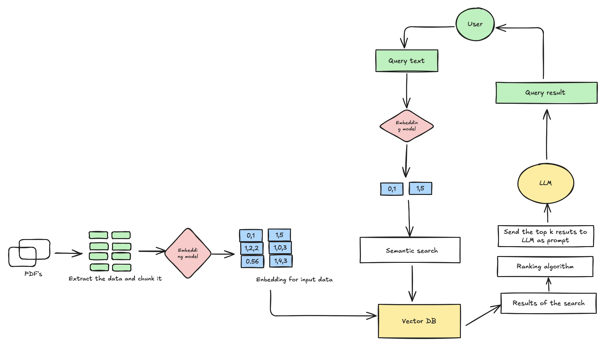

# 📚 Chat with PDF - RAG System

A powerful Python application that allows you to chat with multiple PDF documents using Retrieval-Augmented Generation (RAG). Ask questions about your PDFs in natural language and get intelligent, context-aware responses.

## Architecture




## ✨ Features

- **Multi-PDF Support**: Upload and chat with multiple PDF documents simultaneously
- **Advanced RAG Pipeline**: Uses LangChain for orchestration with state-of-the-art embeddings
- **Multiple LLM Options**: Support for Google Gemini (free tier) and HuggingFace models
- **Smart Text Chunking**: Intelligent document splitting for optimal retrieval
- **Source Attribution**: See exactly which pages and documents your answers come from
- **Beautiful UI**: Modern Streamlit interface with intuitive design
- **Real-time Processing**: Instant PDF processing and question answering

## Architecture


## 🚀 Quick Start

### 1. Clone the Repository
```bash
git clone <your-repo-url>
cd chat-with-pdf-rag
```

### 2. Install Dependencies
```bash
pip install -r requirements.txt
```

### 3. Set Up API Keys
Create a `.env` file in the project root:
```bash
# Copy the example file
cp env_example.txt .env
```

Then edit `.env` and add your API keys:
```env
# Google API Key for Gemini LLM (Recommended - Free tier available)
# Get your API key from: https://makersuite.google.com/app/apikey
GOOGLE_API_KEY=your_google_api_key_here

# HuggingFace API Key (Alternative option)
# Get your API key from: https://huggingface.co/settings/tokens
HUGGINGFACE_API_KEY=your_huggingface_api_key_here
```

**Note**: You only need one API key. Google API Key is recommended as it provides free access to Gemini Pro.

### 4. Test Your Setup (Optional)
```bash
python3 test_setup.py
```

### 5. Run the Application
```bash
python3 run.py
# or
streamlit run app.py
```

The application will open in your browser at `http://localhost:8501`

## 🧪 Testing and Demo

### Test Your Setup
Run the setup verification script to ensure everything is configured correctly:
```bash
python3 test_setup.py
```

### Try the Demo
Test the RAG system with sample AI content:
```bash
python3 demo.py
```

## 📖 How to Use

1. **Upload PDFs**: Use the sidebar to upload one or more PDF files
2. **Process Documents**: Click "Process PDFs" to extract and index the content
3. **Ask Questions**: Type your questions in natural language
4. **Get Answers**: Receive intelligent responses with source citations
5. **View Sources**: See which pages and documents were used to generate answers

## 🏗️ Architecture

The application follows a sophisticated RAG pipeline:

```
PDF Documents → Text Extraction → Chunking → Embeddings → Vector Store → Retrieval → LLM → Response
```

### Components:

- **PDF Loader**: Extracts text from PDF documents using PyPDF2
- **Text Splitter**: Divides documents into manageable chunks with overlap
- **Embeddings**: Uses Google's text-embedding-gecko for semantic understanding
- **Vector Store**: FAISS for efficient similarity search
- **Retriever**: Finds most relevant document chunks
- **LLM**: Google Gemini or HuggingFace models for response generation
- **Custom QA Chain**: Optimized for reliable source document retrieval

## 🔧 Configuration

### Environment Variables

| Variable | Description | Required |
|----------|-------------|----------|
| `GOOGLE_API_KEY` | Google AI API key for Gemini | Yes (recommended) |
| `HUGGINGFACE_API_KEY` | HuggingFace API key | Alternative |

### Model Configuration

The application uses:
- **Embeddings**: `models/embedding-001` (Google text-embedding-gecko)
- **LLM**: Google Gemini 2.0 Flash (default) or HuggingFace models
- **Vector Store**: FAISS with similarity search
- **Chunking**: RecursiveCharacterTextSplitter with 1000 token chunks

## 📁 Project Structure

```
chat-with-pdf-rag/
├── app.py              # Main Streamlit application
├── demo.py             # Demo script for testing
├── test_setup.py       # Setup verification script
├── run.py              # Simple launcher script
├── utils.py            # Utility functions
├── requirements.txt    # Python dependencies
├── env_example.txt     # Environment variables template
├── README.md          # This file
└── .env               # Your API keys (create this)
```

## 🛠️ Customization

### Adding New LLM Providers

To add support for additional LLM providers:

1. Add the provider's package to `requirements.txt`
2. Modify the `initialize_qa_chain()` method in `app.py`
3. Add the corresponding API key to the environment variables

### Modifying Embeddings

To use different embedding models:

1. Update the `initialize_embeddings()` method in `app.py`
2. Choose from available Google or HuggingFace embedding models
3. Adjust chunk size and overlap as needed

### Customizing the UI

The Streamlit interface can be customized by modifying:
- Page configuration in `main()`
- Sidebar layout and components
- Chat interface styling
- Response formatting

## 🔍 Troubleshooting

### Common Issues

1. **API Key Errors**
   - Ensure your API key is correctly set in `.env`
   - Verify the key has the necessary permissions
   - Check if you've reached usage limits

2. **PDF Processing Errors**
   - Ensure PDFs are not corrupted
   - Check file size limits
   - Verify PDFs contain extractable text

3. **Memory Issues**
   - Reduce chunk size for large documents
   - Process fewer PDFs simultaneously
   - Increase system memory if available

4. **Slow Performance**
   - Use smaller embedding models
   - Reduce the number of retrieved chunks
   - Consider using GPU acceleration
   - The Google embedding model is optimized for speed

5. **Dictionary Output Errors**
   - Ensure you're using the latest version of LangChain
   - The custom QA chain handles output formatting automatically

### Logs

The application provides detailed logging. Check the console output for:
- PDF processing status
- Embedding generation progress
- API call results
- Error messages

## 🤝 Contributing

Contributions are welcome! Please feel free to submit a Pull Request.

### Development Setup

1. Fork the repository
2. Create a feature branch
3. Make your changes
4. Add tests if applicable
5. Submit a pull request

## 🙏 Acknowledgments

- [LangChain](https://langchain.com/) for the RAG framework
- [Streamlit](https://streamlit.io/) for the web interface
- [Google AI](https://ai.google/) for Gemini LLM and text-embedding-gecko
- [HuggingFace](https://huggingface.co/) for alternative models
- [FAISS](https://github.com/facebookresearch/faiss) for vector search

---

**Happy Chatting! 🎉**
